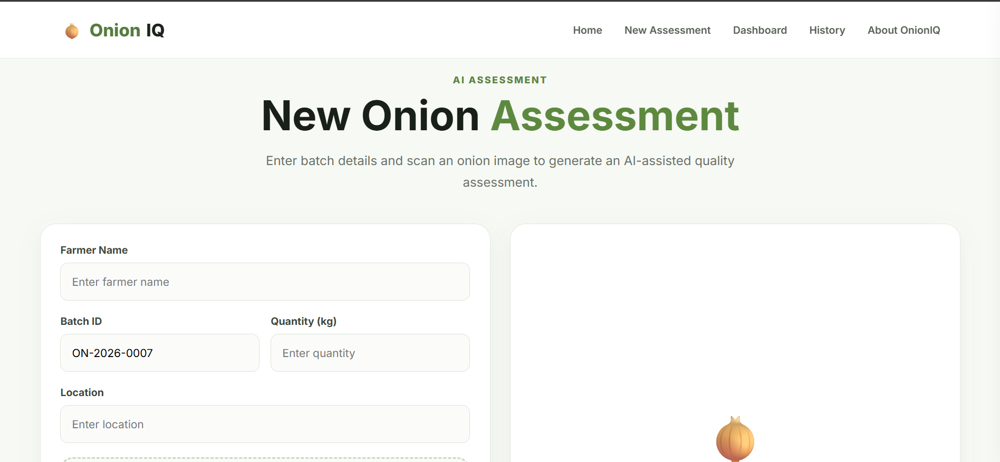
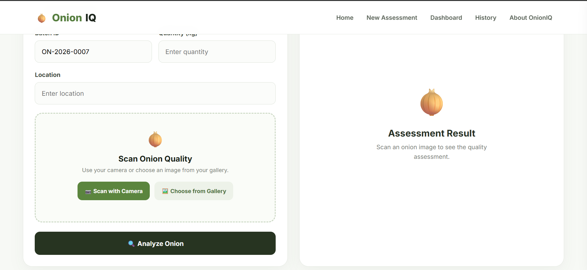
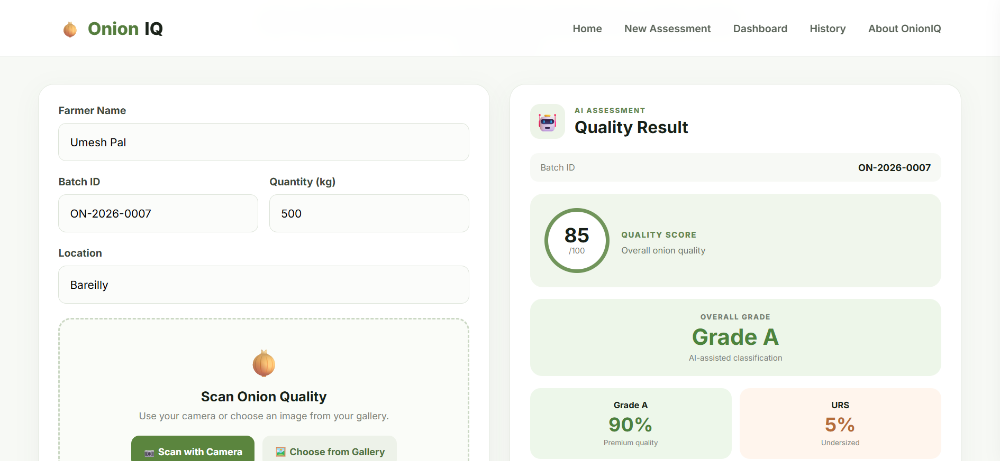
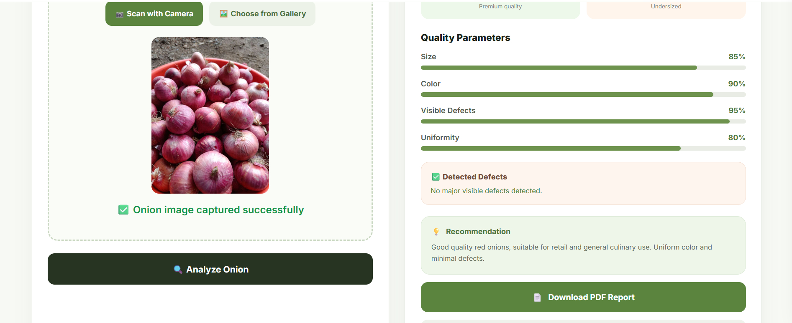
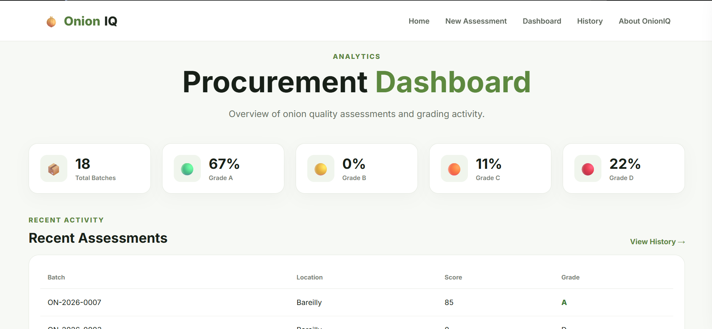
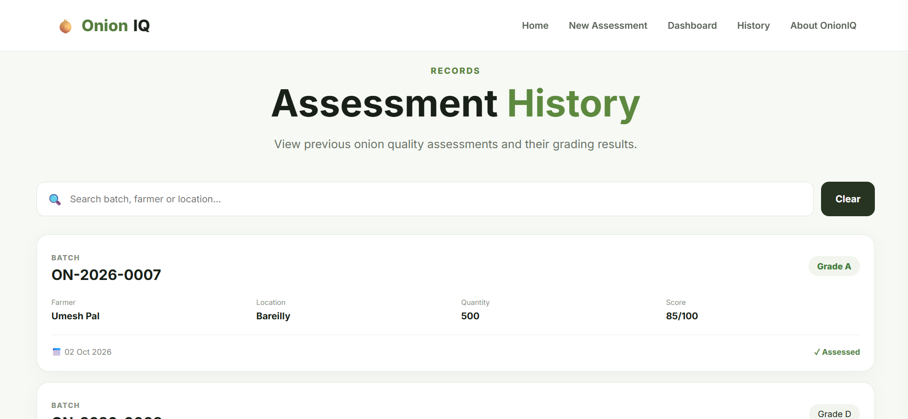

# 🧅 OnionIQ

### AI-Based Onion Quality Assessment & Grading

OnionIQ is an AI-powered web and Android application that helps assess onion quality using image analysis.

Users can capture or upload an onion image and get a quality score, grade, visible defects, quality parameters, and recommendation.

---

## 🚀 Features

- 📷 Capture or upload onion images
- 🤖 AI-based quality analysis
- 📊 Quality score
- 🏷️ Grade A, B, C and D
- 🔍 Visible defect detection
- 📈 Quality parameters
- 📋 Batch-wise assessment
- 🗄️ Assessment history
- 📊 Dashboard
- 📄 PDF reports
- 📱 Android application

---

## ⚙️ How It Works

```text
Capture / Upload Image
          ↓
      AI Analysis
          ↓
   Quality Assessment
          ↓
    Score + Grade
          ↓
Defects + Recommendation
          ↓
    Save Assessment
```

## 🖥️ Working Prototype

### 1. New Assessment
Users can enter batch details and capture or upload an onion image.




### 2. AI Quality Analysis
OnionIQ analyzes the image and generates the quality score, grade, defects and recommendation.




### 3. Dashboard
The dashboard provides an overview of assessments and quality grades.



### 4. Assessment History
Previous assessments are stored and can be viewed later.



# 🛠️ Tech Stack

## Frontend

- HTML5
- CSS3
- JavaScript
  
## Backend

- Node.js
- Express.js
- Multer
- CORS
  
## AI

- Google Gemini API
  
## Database

- MongoDB
- Mongoose
  
## Android

- Capacitor
  
## Deployment

- Vercel
- Render
  
# 📊 Assessment Parameters

OnionIQ analyzes visible onion characteristics such as:

- Size
- Color
- Visible Defects
- Uniformity
- Damaged Onions
- Rotten Onions
- Sprouted Onions
- Undersized Onions
  
## Output

- Quality Score
- Grade
- Grade A Percentage
- URS Percentage
- Detected Defects
- Recommendation
  
# 🖥️ Application

## Web Application

OnionIQ provides a simple interface for creating a new assessment, uploading or capturing an onion image, and viewing the AI-generated result.

## Android Application

The web application is also packaged as an Android application using Capacitor.

# 🔮 Future Improvements

- Larger labeled onion image dataset
- Dedicated onion grading model
- Improved defect detection
- Multi-image batch analysis
- Low-network/offline support
- Hindi and regional language support
- Advanced farmer and buyer analytics

# 👨‍💻 Project

### OnionIQ — AI-Based Onion Quality Assessment & Grading

Developed as a working prototype for smart and digital onion quality assessment.
